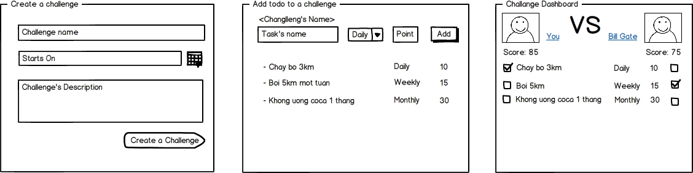

30 days Challenge
=================

- 
- after clone code from repos, each team should create a new branch from master branch `git checkout -b <team_name> master`
- run `rake db:create`
- run `rake db:migrate`
- run `rails server`

## Features:

- Account creation
- Login
- Todo list creation
- Add tasks
- Invite friend to task
- Challenge statictics
- Bonus points:
    * Set privacy to task ( public/private (only invitted can join))
    * Ajax
    * Nice template/ layout
    * Deploy your app to heroku or any servers

## Notes:

- Database postgreSQL (but you can use any other one you like, e.g Mysql, )
- Login: Use gem devise
- Push you code to github before 03/09/2014 12:00 AM

## References & Documents:

- Generate rails app  [Rails-composer](https://github.com/RailsApps/rails-composer)
- Authenticate `gem devise`  [devise](https://github.com/plataformatec/devise)
- Authorization `gem pundit`[pundit](https://github.com/elabs/pundit)
- [Bootstrap 3.0.0](http://getbootstrap.com/)
- Form builder `gem simpleform` [simpleform](https://github.com/plataformatec/simple_form)
- [Coffee Script](http://coffeescript.org/)
